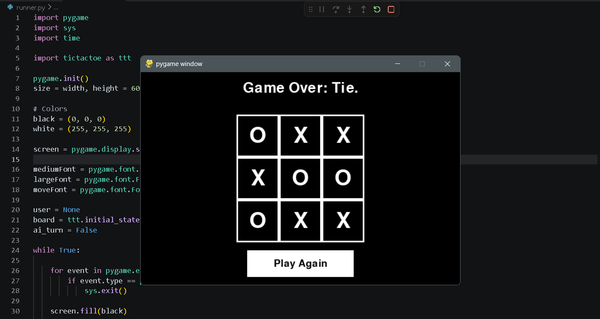

# Unbeatable Tic-Tac-Toe AI (Adversarial Search)

<p align="center">
  
</p>


An interactive, graphical Tic-Tac-Toe game featuring an unbeatable Artificial Intelligence opponent. The game engine is built using **Python** and **Pygame**, while the decision-making logic relies entirely on a custom, manual implementation of the **Minimax Algorithm** without external AI libraries.

##  How the AI Works
The backend logic views the game tree through the lens of **Game Theory (Zero-Sum Games)**:
* **Maximizer ($X$):** Competes to achieve the highest possible terminal score (+1).
* **Minimizer ($O$):** Competes to force the lowest possible terminal score (-1).

Every time it is the AI's turn, it recursively simulates every allowable path down to the terminal states (win, loss, or tie), passing optimal utility scores back up the tree using `getmax` and `getmin` functions to execute the flawless move.

##  Features Implemented
* **Pure State Tracking:** Complete separation of game-state tracking (`tictactoe.py`) from the rendering loop (`runner.py`).
* **Immutability Protection:** Employs deep copying (`copy.deepcopy`) to safely explore hypothetical branches of the game tree without mutating the active live board.
* **Turn & Boundary Validations:** Smart lookups for determining alternating turns based on cell population density and robust boundary exception handling.

##  Getting Started

### Prerequisites
Make sure you have Python 3.x and Pygame installed on your local system.

```bash
pip install pygame


The project functions are mapped out as follows:

player(board): Determines whose turn it is (X or O).
actions(board): Filters all empty, executable coordinates (i, j).
minimax(board): Synthesizes the final optimal coordinate path.
utility(board): Dictates numerical payoffs (1, -1, or 0).
terminal(board): Checks if a terminal state (win or draw) has occurred.
winner(board): Evaluates horizontal, vertical, and diagonal winning vectors.
result(board, action): Previews transitional board states safely.


